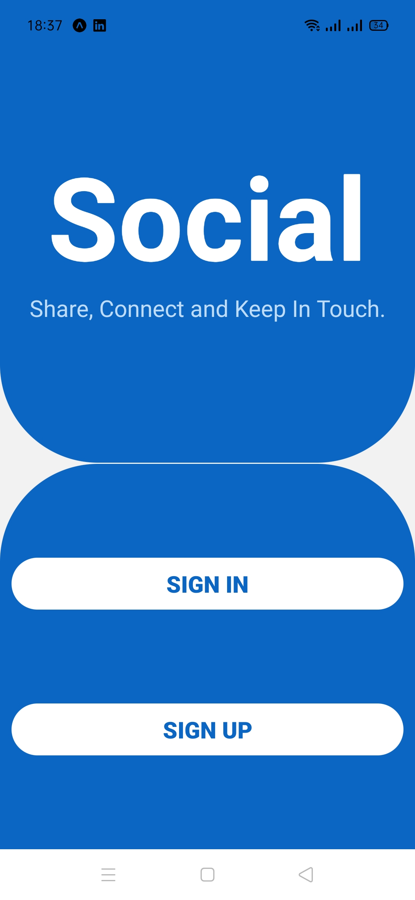

# SocialShare
**Social** is a social media app that was developed using React native.
 
**Social** is inspired by Instagram, it allows the users to share their photos with other users.

# Screenshots
## Landing Screen 

## Login Screen

## Register Screen

## Feed Screen

## Profile Screen

## Search Screen

