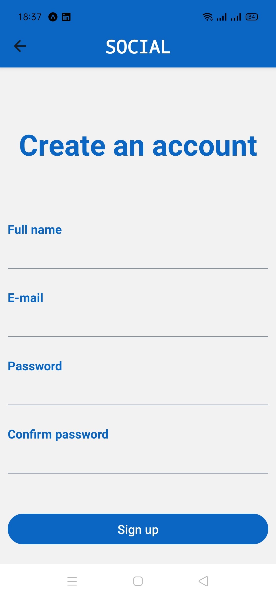

# SocialShare

<h2 align="center">
 
  **Social** is a social media app that was developed using React native. 

   **Social** is inspired by Instagram, it allows the users to share their photos with other users. 

  <a href="https://reactnative.dev/">
    React Native
  </a>
</h1>

  <strong>Learn once, write anywhere:</strong> 
  Build mobile apps with React.

  
  
  
  
  

# Screenshots
## Landing Screen 
<kbd>

</kbd>

## Login Screen
<kbd>

</kbd>

## Register Screen
<kbd>

</kbd>

## Feed Screen
<kbd>

</kbd>

## Profile Screen
<kbd>

</kbd>

## Search Screen
kbd>

</kbd>

